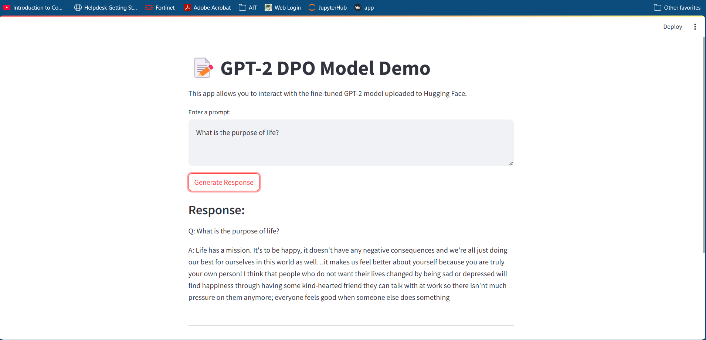
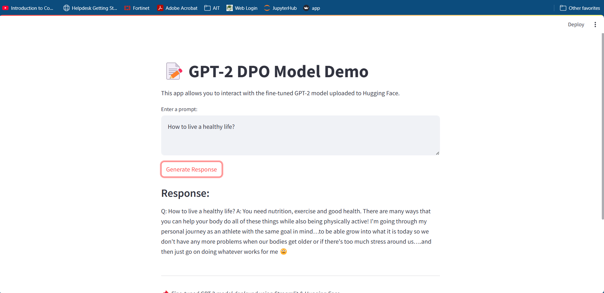

# NLP Assignment 5-Direct Preference Optimization (DPO) Model Training(AIT - DSAI)

- [Student Information](#student-information)
- [Project Overview](#project-overview)
- [Task 1: Finding a Suitable Dataset](#task-1---finding-a-suitable-dataset)
   - [Dataset Details](#dataset-details)
- [Task 2: Training a Model with `DPOTrainer'](#task-2---training-a-model-with-DPOTrainer)
   - [Training Configuration](#training-configuration)
   - [Training Process](#training-process)
- [Task 3: Pushing the Model to Hugging Face](#task-3---pushing-the-model-to-hugging-face)
   - [Uploaded Files](#uploaded-files)
- [Task 4: Web Application Deployment](#task-4---web-application-deployment)
    - [How It Works](#how-it-works)
    - [Run the Application](#run-the-application)

## **Student Information**
 - Name: Phue Pwint Thwe
 - ID: st124784

## Project Overview

### **Task 1: Finding a Suitable Dataset**
The dataset used for training is **`Dahoas/static-hh`**, a publicly available dataset on Hugging Face, designed for **human preference optimization**. It consists of multiple prompts along with corresponding **chosen** and **rejected** responses.

#### **Dataset Details**
- **Total samples**: 64,000 pairs
- **Train-test split**:
  - **Training set**: 58,000 samples (90%)
  - **Test set**: 6,000 samples (10%)
- **Preprocessing**:
  - Removed missing or incomplete responses.
  - Tokenized using GPT-2 tokenizer with a max length of **512 tokens**.
  - Ensured prompts start with `"Q: "` and responses with `"A: "`.

---

### **Task 2: Training a Model with `DPOTrainer`**
We fine-tuned a **GPT-2 model** using **Direct Preference Optimization (DPO)**, which optimizes responses based on human preferences.

#### **Training Configuration**
- **Base Model**: `gpt2`
- **Trainer**: `DPOTrainer`
- **Hyperparameters**:
  - **Learning Rate**: `1e-3`
  - **Batch Size**: `8`
  - **Epochs**: `5`
  - **Beta**: `0.1`
- **Gradient Accumulation Steps**: `1`
- **Evaluation Strategy**: `"epoch"`
- **Optimization Algorithm**: `AdamW`
- **Gradient Checkpointing**: Enabled for memory efficiency

#### **Training Process**
- We trained multiple configurations using a hyperparameter search.
- The best-performing model achieved the lowest evaluation loss and was selected for deployment.

---

### **Task 3: Pushing the Model to Hugging Face**
The fine-tuned model was uploaded to **Hugging Face Hub** under the repository:

🔗 **[PhuePwint/dpo_gpt2](https://huggingface.co/PhuePwint/dpo_gpt2)**

#### **Uploaded Files**
- `config.json` - Model configuration
- `tokenizer.json` - Tokenizer settings
- `model.safetensors` - Trained model weights
- `training_args.bin` - Training hyperparameters

---

### **Task 4: Web Application Deployment**
A **Streamlit-based web application** was developed to demonstrate the model's capabilities.

### Example Outputs
Here are sample responses generated by the model:

**Prompt:** What is the purpose of life?

**Response:**
```
Life has a mission. It's to be happy, it doesn't have any negative consequences and we're all just doing our best for ourselves in this world as well... it makes us feel better about yourself because you are truly your own person! I think that people who do not want their lives changed by being sad or depressed will find happiness through having some kind-hearted friend they can talk with at work so there isn't much pressure on them anymore; everyone feels good when someone else does something.
```



**Prompt:** How to live a healthy life?

**Response:**
```
You need nutrition, exercise, and good health. There are many ways that you can help your body do all of these things while also being physically active! I'm going through my personal journey as an athlete with the same goal in mind... to be able to grow into what it is today so we don't have any more problems when our bodies get older or if there's too much stress around us.... and then just go on doing whatever works for me 😊
```



#### **How It Works**
- Users enter a prompt in the application.
- The fine-tuned GPT-2 model generates a response.
- The application displays the response in real-time.

#### **Run the Application**
To run the application locally:
```bash
streamlit run app.py

